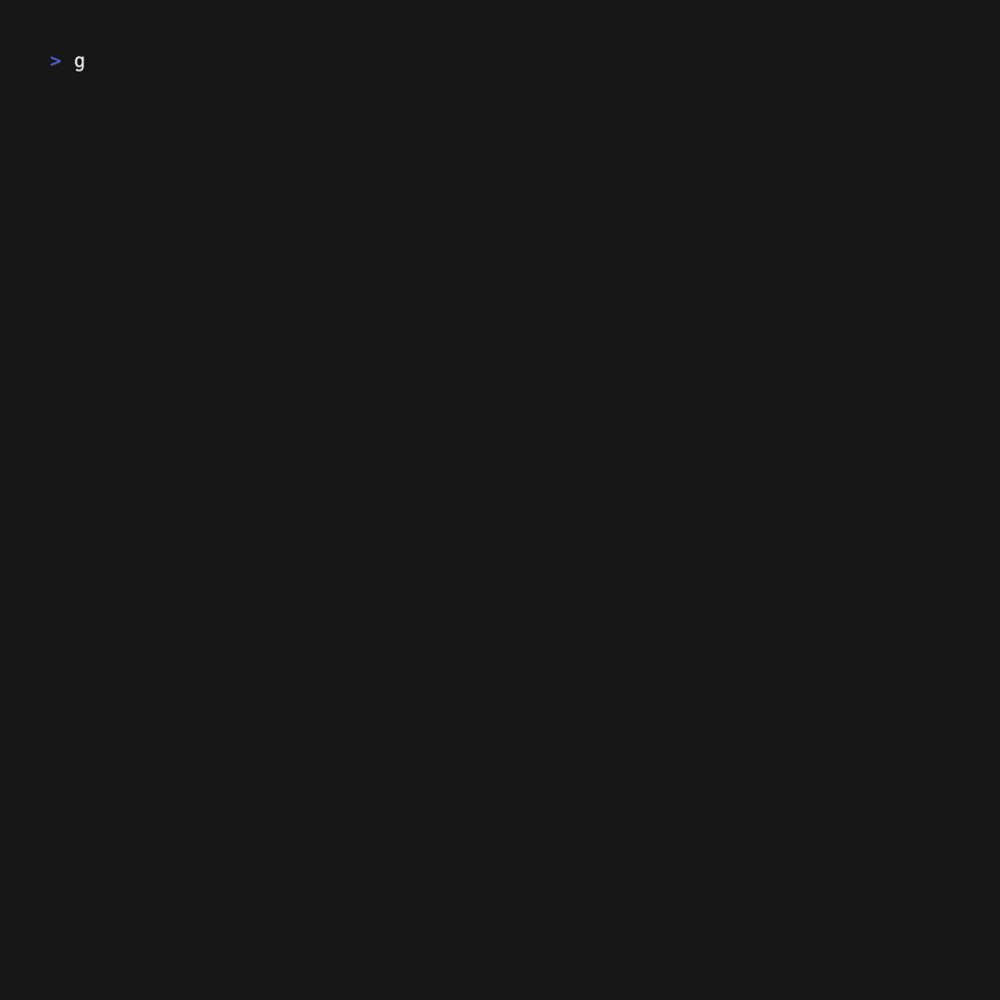

# Game of Life TUI

This project is an exploration of building a Text User Interface (TUI) using the Bubble Tea framework, applied to the well-understood problem of Conway's Game of Life.



## Overview

The Game of Life, devised by mathematician John Conway, is a cellular automaton simulation that demonstrates how complex patterns can emerge from simple rules. This implementation brings the classic simulation to life in your terminal using Go and the Bubble Tea framework.

## Features

- **Bubble Tea TUI**: Utilizes the [Bubble Tea](https://github.com/charmbracelet/bubbletea) framework to create an interactive and visually appealing terminal interface.
- **Game of Life Simulation**: Implements the classic rules of Conway's Game of Life.
- **Interactive Controls**: Toggle the simulation on/off and quit the application with simple key commands.
- **Colorful Display**: Uses [lipgloss](https://github.com/charmbracelet/lipgloss) for styling, making the game board visually distinct and easy to read.
- **Flexible Initialization**: Supports random generation or initialization from input files.
- **Customizable Grid Size**: Allows specifying custom grid dimensions via command-line flags.

## How It Works

The application combines the simplicity of the Game of Life rules with the power of Bubble Tea's event-driven architecture:

1. **Grid Initialization**: The game starts with either a randomly populated grid or a predefined pattern from an input file.
2. **Simulation Loop**: In each tick, the next generation of cells is calculated based on the current state.
3. **User Interface**: Bubble Tea handles the rendering and user input, creating a responsive TUI.
4. **Game Logic**: The core Game of Life rules are implemented in the `nextGeneration` function.

## Getting Started

To run the Game of Life TUI:

1. Ensure you have Go installed on your system.
2. Clone this repository.
3. Run `go mod tidy` to install dependencies.
4. Execute `go run main.go` to start the application with default settings.

## Running the Program

There are several ways to run the program:

1. **Default Random Grid**:
   ```
   go run main.go
   ```
   This will create a 40x25 grid with random initial state.

2. **Custom Grid Size**:
   ```
   go run main.go -width 60 -height 40
   ```
   This will create a 60x40 grid with random initial state.

3. **Using an Input File**:
   ```
   go run main.go -input examples/glider_gun.gol
   ```
   This will initialize the grid based on the pattern in the `glider_gun.gol` file.

### Input File Format

Input files should use the following format:
- Use `*` or `1` to represent live cells
- Use any other character (typically `.`) to represent dead cells
- Ensure all rows have the same length

Example (glider pattern):
```
....
.*..
..*.
***
```

## Controls

- Press `r` to toggle the simulation on/off
- Press `q` or `Ctrl+C` to quit the application

## Testing

Unit tests are provided to ensure the correctness of the Game of Life rules implementation. Run `go test` to execute the tests.

## Creating a Screen Recording

You can create a GIF or video of the Game of Life TUI in action using [VHS](https://github.com/charmbracelet/vhs). Here's how:

1. Install VHS:
   - On macOS, you can use Homebrew:
     ```
     brew install vhs
     ```
   - For other operating systems, follow the instructions on the [VHS GitHub page](https://github.com/charmbracelet/vhs).

2. Run the following command in your terminal:
   ```
   vhs -o vhs/gol-tui.gif vhs/gol-tui.tape
   ```

## Eventual goal.
We intend to implement many of the patterns found on https://conwaylife.com.
Feel free to send pull requests.

## Awesome Resources:
[Conway Life Book](https://conwaylife.com/book)
[LifeWiki](https://conwaylife.com/wiki)

## Conclusion

This project demonstrates how a well-understood problem like the Game of Life can be reimagined as an interactive terminal application using modern Go libraries. It serves as both a learning tool and a starting point for more complex TUI applications.

Feel free to explore, modify, and expand upon this code to deepen your understanding of Go, Bubble Tea, and cellular automata!
